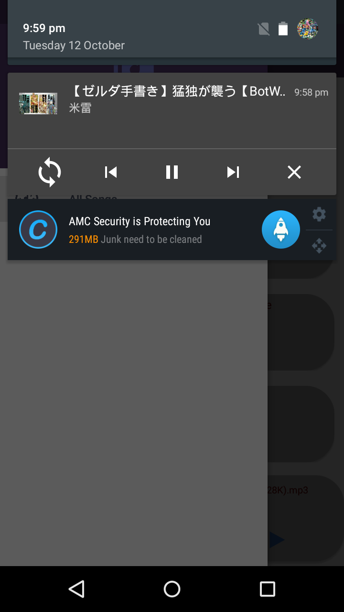
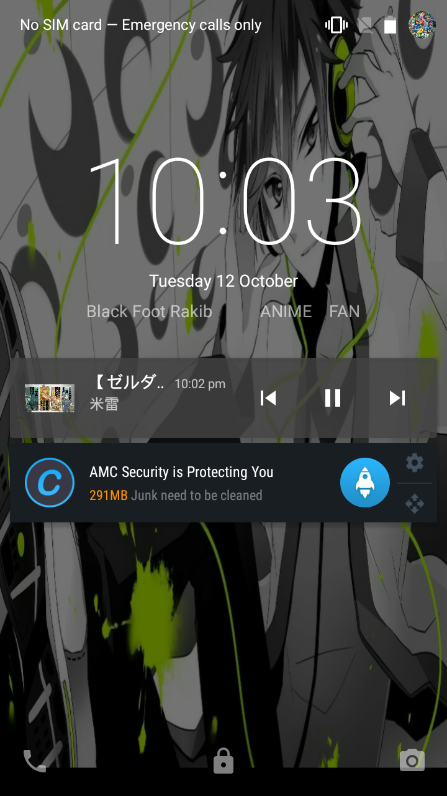
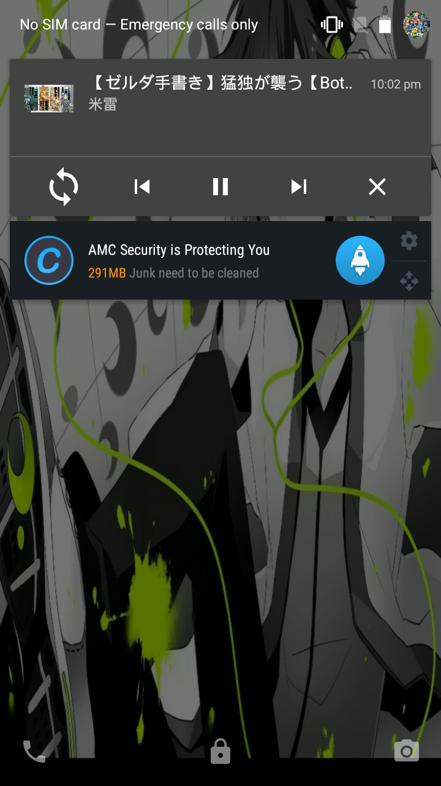
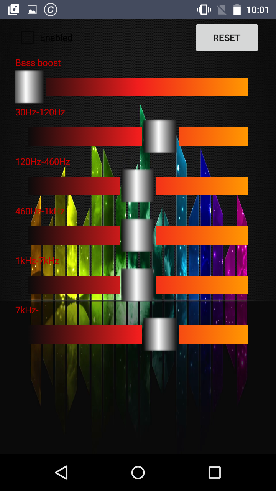
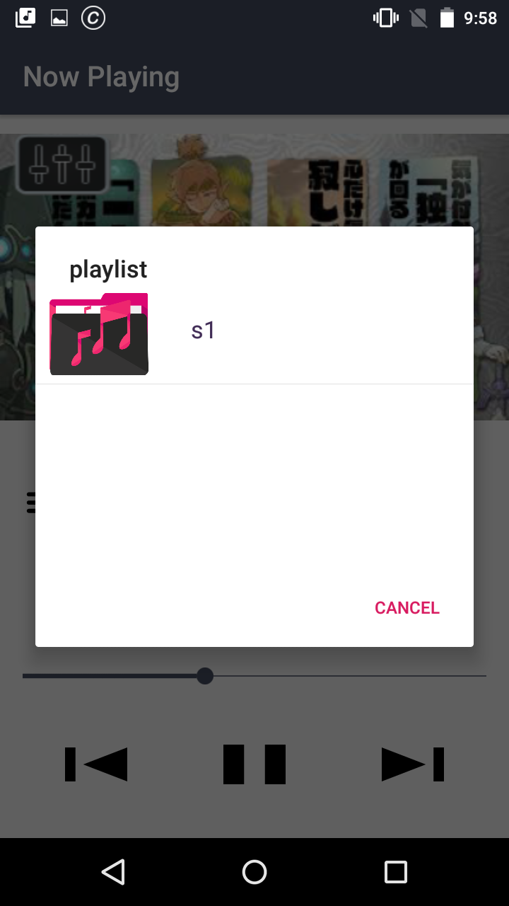
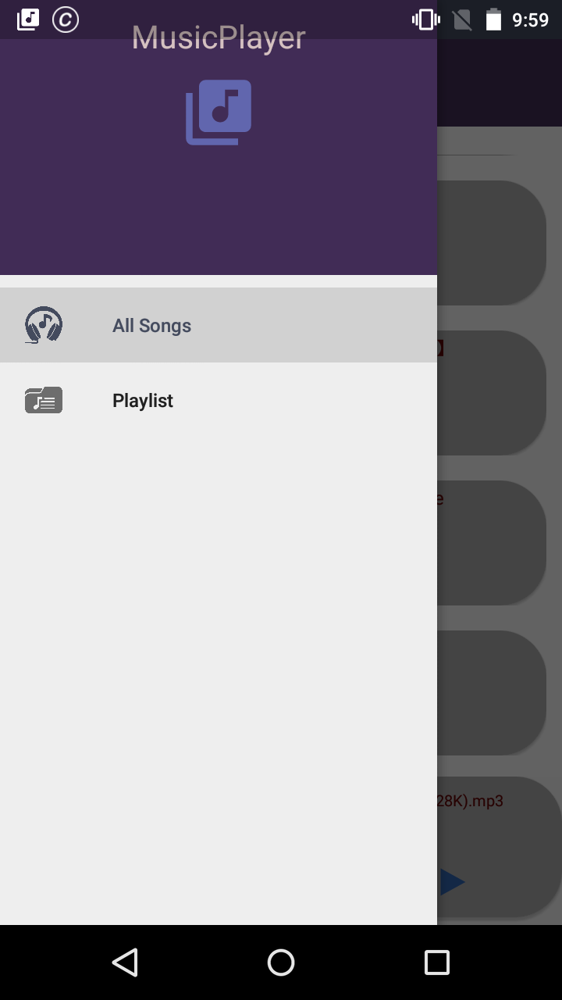
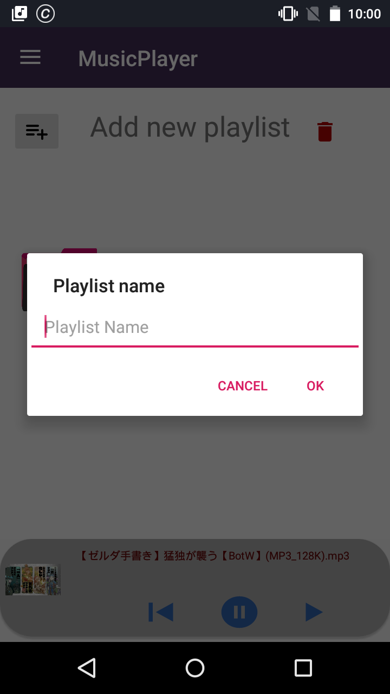
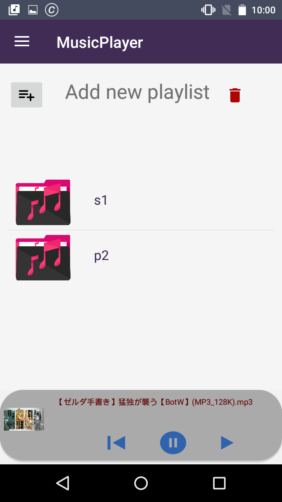
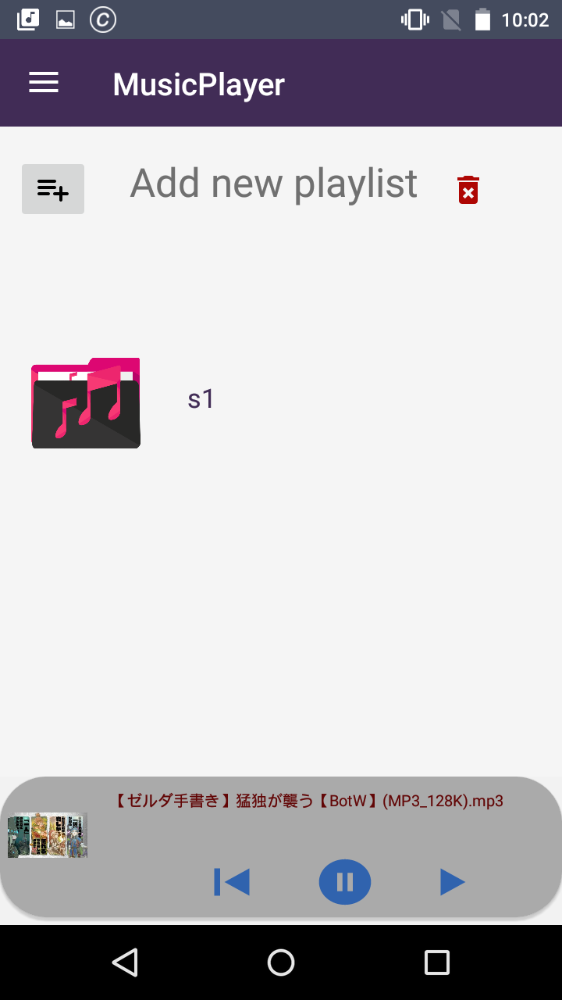

# MusicPlayer
This is a native android app.

## Components Used

* Android Studio
* Room Database

## Features of This App

* [Load All Music from device](#load-all-music-from-device)
* [Play Music](#play-music)
* [Background Music Play Support](#background-music-play-support)
* [Foreground Music Play Control](#foreground-music-play-control)
* [Last Played Song Save](#last-played-song-save)
* [Equalizer](#equalizer)
* [Playlist](#playlist)
* [Splash Screen](#splash-screen)

## Features details with screenshots

### Load All Music from device

### Play Music

### Background Music Play Support
This app support playing music in the background

### Foreground Music Play Control

### Last Played Song Save
When app is opened again it shows in the bottom which song is played last time

### Equalizer

### Playlist

### Splash Screen

